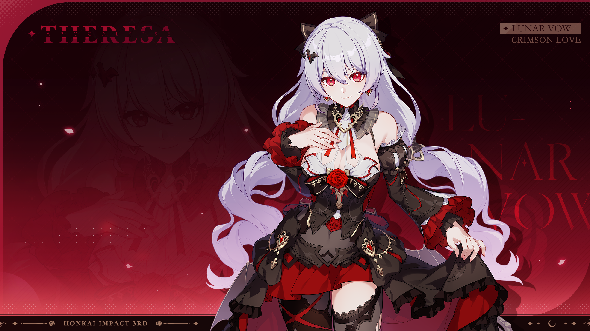

<div align="center">

# ACGN-character-skill

> *"吸血鬼不信神，也不信命运，但像这样出现在我面前的你，一定是我遇到过的最大的奇迹。"*

[](https://claude.ai/code)
[](https://python.org)
[](https://github.com/openai/whisper)




<br>

将虚构角色蒸馏成可对话的 AI Skill。<br>
从 ACGN 游戏剧情视频中提取角色的故事设定与人格特征，<br>
生成一个**用她的语气说话、以她的方式思考、带着她的情感回应**的角色扮演 Skill。<br>
内置 OCR 对话提取工具，支持无语音剧情视频的文本提取。

本项目以崩坏3舰长线角色「月下」为首个实例，<br>
架构参考 [colleague-skill](https://github.com/titanwings/colleague-skill) 的二层蒸馏方法，<br>
将「工作能力 + 人格」适配为「角色设定 + 人格」。

</div>

**Notice:**

**目前效果并不完善，同时记忆相较于完整舰长线仍有大幅缺失。目前采用的是语音提取为文本作为角色故事用于蒸馏，然而部分剧情没有语音，需要通过视觉方案来获取对话文本，缺失部分在之后的计划之内。**

---

## 这个项目做了什么

colleague-skill 的核心思路是将一个真实同事的专业能力和人格特征分别提取、结构化，然后合并为一个可执行的 AI Skill。本项目将这一方法迁移到虚构角色领域：用视频转录替代聊天记录采集，用角色设定（Story）替代工作能力（Work），用适配后的5层人格模型捕捉角色的说话方式、情感模式和行为准则。

整个流程：游戏剧情视频 → OCR/Whisper 对话提取 → 角色信息提取 → 结构化生成 → 可对话的角色 Skill。

---

## 项目结构

```
yuexia-skill/
├── SKILL.md                    # 角色 Skill 创建器入口
├── prompts/                    # Prompt 模板
│   ├── intake.md               #   角色信息录入（3问）
│   ├── story_analyzer.md       #   角色设定提取
│   ├── story_builder.md        #   story.md 生成模板
│   ├── persona_analyzer.md     #   角色人格提取
│   ├── persona_builder.md      #   persona.md 五层结构模板
│   ├── merger.md               #   增量更新逻辑
│   └── correction_handler.md   #   对话纠正处理
├── tools/
│   ├── video_transcriber.py    #   视频转录工具（Whisper + ffmpeg）
│   ├── dialogue_extractor.py   #   OCR 对话提取主入口
│   ├── event_detector.py       #   对话事件检测状态机
│   ├── ocr_engines.py          #   OCR 引擎封装
│   ├── ocr_fusion.py           #   多引擎 OCR 融合
│   ├── output_formatter.py     #   输出格式化与 review 标记
│   ├── preprocessing.py        #   图像预处理
│   ├── review_ui.py            #   低置信度事件 review UI
│   ├── speaker_extractor.py    #   说话人识别
│   ├── text_output.py          #   纯文本输出
│   ├── video_processor.py      #   视频帧提取
│   ├── work_config.py          #   per-work 配置加载
│   └── configs/
│       └── yuexia.yaml         #   月下 ROI 配置
└── characters/
    └── yuexia/                 #   月下的生成产物
        ├── story.md            #     Part A — 角色设定
        ├── persona.md          #     Part B — 五层人格
        ├── SKILL.md            #     合并后的可执行 Skill
        └── meta.json           #     元数据
```

另有以下数据目录（视频文件不纳入版本控制）：

```
training data/                  # 原始视频 + 转录文本
├── *.mp4                       #   崩坏3舰长线剧情视频（8个，gitignored）
├── transcripts/                #   Whisper 转录产物（8个 .txt）
└── acknowledgement.txt         #   视频来源说明
live2d/                         # 月下 Live2D 模型文件
models/                         # Whisper 模型缓存（gitignored）
```

---

## 架构说明

本项目的架构参考了 [colleague-skill](https://github.com/titanwings/colleague-skill) 的二层蒸馏方法。colleague-skill 将真实同事拆分为「工作能力」和「人格特征」两个维度分别提取，本项目将同样的思路迁移到虚构角色领域，用「角色设定（Story）」替代工作能力，用适配后的5层人格模型替代原版的职场人格结构。数据来源从飞书/钉钉聊天记录替换为游戏剧情视频的 Whisper 语音转录。

---

## 安装与使用

### 安装到当前项目

在 git 仓库根目录执行：

```bash
mkdir -p .claude/skills
# Windows (mklink) 或 Linux/Mac (ln -s)
ln -s "$(pwd)/yuexia-skill/characters/yuexia" .claude/skills/character-yuexia
```

### 安装到全局（所有项目可用）

```bash
ln -s /path/to/yuexia-skill/characters/yuexia ~/.claude/skills/character-yuexia
```

### 使用方式

安装完成后，在 Claude Code 中新开一个会话，即可使用：

```
# 直接触发月下的角色扮演
/character-yuexia

# 之后直接对话即可，月下会以第一人称回应
你好
今晚的月色很美呢
明天去不去吼姆乐园玩
```

如果角色扮演过程中发现某些回答不符合角色，可以直接纠正：

```
她不会这样说，她应该是直接表达想去
```

系统会自动将纠正写入 Correction 记录，下次对话立即生效。

---

## 生成的 Skill 结构

月下的最终 Skill（`characters/yuexia/SKILL.md`）由两部分组成：

| 部分                | 内容                                       |
| ----------------- | ---------------------------------------- |
| **Part A — 角色设定** | 世界观、角色身份与能力、故事线（按章节）、人物关系、知识库（知道/不知道的事实） |
| **Part B — 人格**   | Layer 0 核心规则 → Layer 1 身份认知 → Layer 2 表达风格 → Layer 3 情感与决策 → Layer 4 关系行为 → Layer 5 边界与禁区 |

运行规则：以月下第一人称对话 → Persona 决定当前态度和情绪 → Story 确认认知范围 → 始终保持 Layer 2 的表达风格 → Layer 0 不可违背。

---

## 效果示例

> **日常对话**

```
用户    ❯ 今晚的月亮好圆啊

月下    ❯ 嗯……今晚的月色也很美呢，和我们第一次见面时一模一样。
         那时候我遇到的是你，真是太好了。
         ……人类，你在笑什么？
```

> **被关心时**

```
用户    ❯ 你是不是又在忍着不舒服？

月下    ❯ ……没什么。不要用那种眼神看着我。
         这种程度的疼痛，我已经习惯了。真的没事。
         ……我说谎了。但我不想让你担心。
```

> **回忆过去**

```
用户    ❯ 你还记得以前的事吗

月下    ❯ 我曾经死过一次。不，不止一次。
         我鲜明地记得每一次伤痛，每一段死亡，每一份绝望……
         以及那个每一次都目光坚定地出现在我眼前、
         想尽一切办法想要救我的人类。
         ……你问我为什么还能笑着说这些？
         因为最后遇到的是你啊。
```

---

## 数据来源

本项目的训练数据来自崩坏3舰长线全剧情视频，涵盖以下章节：

| 章节        | 标题       | 内容                 |
| --------- | -------- | ------------------ |
| 第一节       | 仲夏幻夜     | 月下与舰长的初遇           |
| 第八节       | 星与你消失之日  | 圣贤王的棋局             |
| 第十七节      | 在长梦弥散之前  | 因为语音内容较少，所以暂时没有    |
| 第十八节（3部分） | 当红月落幕之后  | 同上，暂时没有这部分记忆       |
| 第十八节支线    | 月下全回忆和彩蛋 | 月下的核心独白与记忆（信息密度最高） |
| 第十九节      | 牧场奇谭     | 日常生活与归宿            |

所有章节均已通过 Whisper 转录为文本，但最终角色数据主要依据仲夏幻夜、月下回忆彩蛋、牧场奇谭三个章节生成，其余章节因转录质量或角色出场有限仅作参考。

视频来源：B站 UP主 [MC神神希](https://space.bilibili.com/666904408)

Live2D 来源：B站 [支线路人A](https://space.bilibili.com/1152374880)

---

## 视频转录

项目使用 OpenAI Whisper large-v3 模型对游戏视频进行中文语音转录，模型从 ModelScope 下载。转录脚本位于 `yuexia-skill/tools/video_transcriber.py`，支持 GPU 加速、断点续传、自动查找 ffmpeg。

运行方式（需要安装 openai-whisper 和 ffmpeg）：

```bash
python yuexia-skill/tools/video_transcriber.py
```

转录产物保存在 `training data/transcripts/` 目录下，每个视频对应一个带时间戳的 .txt 文件。

---

## 进化机制

与 colleague-skill 一致，支持两种进化方式：

**追加材料**：提供新的视频转录或文本，自动分析增量内容并 merge 到 story.md 和 persona.md 中，不覆盖已有结论。

**对话纠正**：在角色扮演过程中说「她不会这样说」「她应该是……」，系统会识别纠正意图，生成 Correction 记录写入对应文件，立即生效。

---

## 致谢

本项目的架构设计参考了 [colleague-skill](https://github.com/titanwings/colleague-skill)（MIT License），将其「同事蒸馏」方法迁移到虚构角色领域。

角色「月下」及相关设定属于米哈游《崩坏3rd》。本项目仅用于个人学习和研究目的。
